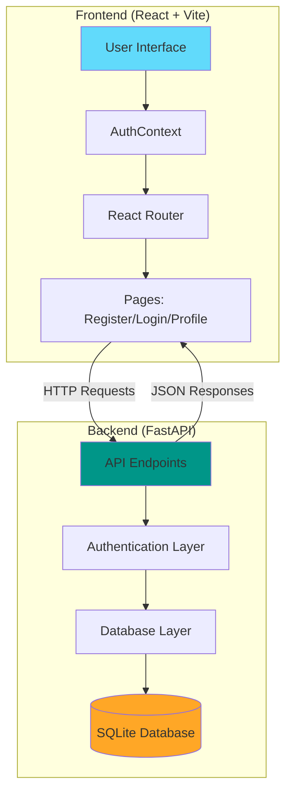

# User Registration System PoC

> A full-stack proof of concept demonstrating modern web application development with FastAPI and React, built entirely with Google Antigravity AI agents.

🌐 **[Live Demo](https://pedroid999.github.io/test-antigravity/)** | 📖 **[API Docs](http://localhost:8000/docs)** (when running)

---

## Overview

This project is a complete user registration and authentication system showcasing best practices in modern web development. It demonstrates:

- **Secure Authentication**: JWT-based authentication with Argon2 password hashing
- **Modern Tech Stack**: FastAPI backend with React frontend
- **Full User Flow**: Registration, login, profile management, and logout
- **Comprehensive Testing**: Automated pytest suite and browser-based verification
- **Production-Ready Patterns**: Proper separation of concerns, protected routes, and CORS configuration

### Key Features

- ✅ User registration with email validation
- ✅ Secure login with JWT token authentication
- ✅ Protected user profile page
- ✅ Password hashing using Argon2 (industry-standard security)
- ✅ Responsive UI with modern design
- ✅ Automatic token management and refresh
- ✅ RESTful API with auto-generated documentation

---

## Architecture

This application follows a clean separation between backend and frontend:



### Component Breakdown

**Backend (`/backend`)**
- `main.py` - FastAPI application entry point with CORS configuration
- `database.py` - SQLite database connection and session management
- `models.py` - SQLModel data models and Pydantic schemas
- `auth.py` - JWT token generation/validation and password hashing
- `routers/users.py` - User registration, login, and profile endpoints

**Frontend (`/frontend`)**
- `src/App.jsx` - Main application with routing configuration
- `src/context/AuthContext.jsx` - Centralized authentication state management
- `src/pages/` - Register, Login, and Profile page components
- `src/index.css` - Global styles and responsive design

---

## Prerequisites

Before you begin, ensure you have the following installed:

- **Python 3.11+** - [Download](https://www.python.org/downloads/)
- **uv** - Fast Python package manager ([Installation guide](https://github.com/astral-sh/uv))
- **Node.js 18+** - [Download](https://nodejs.org/)
- **npm** - Comes with Node.js

---

## Quick Start

Get the application running in 3 steps:

### 1. Clone the Repository

```bash
git clone https://github.com/pedroid999/test-antigravity.git
cd test-antigravity
```

### 2. Start the Backend

```bash
cd backend
uv sync                              # Install dependencies
uv run uvicorn main:app --reload    # Start server on http://localhost:8000
```

### 3. Start the Frontend (in a new terminal)

```bash
cd frontend
npm install                          # Install dependencies
npm run dev                          # Start dev server on http://localhost:5173
```

**✅ Verification**: Open [http://localhost:5173](http://localhost:5173) in your browser. You should see the registration page.

---

## Detailed Setup

### Backend Setup

For detailed backend setup instructions, API documentation, and endpoint details, see:

📄 **[Backend README](backend/README.md)**

**Quick Reference:**
- API runs on `http://localhost:8000`
- Interactive API docs at `http://localhost:8000/docs`
- ReDoc documentation at `http://localhost:8000/redoc`

### Frontend Setup

For detailed frontend setup instructions, component documentation, and build configuration, see:

📄 **[Frontend README](frontend/README.md)**

**Quick Reference:**
- Dev server runs on `http://localhost:5173`
- Build for production: `npm run build`
- Lint code: `npm run lint`

---

## API Documentation

The backend provides a RESTful API with the following endpoints:

| Method | Endpoint | Description | Authentication |
|--------|----------|-------------|----------------|
| `GET` | `/` | Welcome message | No |
| `POST` | `/users/register` | Register a new user | No |
| `POST` | `/users/token` | Login and get JWT token | No |
| `GET` | `/users/me` | Get current user profile | Yes (Bearer token) |

### Authentication Flow

1. **Register**: `POST /users/register` with email, password, and optional full_name
2. **Login**: `POST /users/token` with email and password → receives JWT token
3. **Access Protected Routes**: Include `Authorization: Bearer <token>` header
4. **Token Storage**: Frontend automatically stores token in localStorage

For complete API documentation with request/response examples, visit the auto-generated docs at `http://localhost:8000/docs` when the server is running.

---

## Testing

### Backend Tests

Run the comprehensive pytest test suite:

```bash
cd backend
PYTHONPATH=. uv run pytest
```

Tests cover:
- User registration (success and validation errors)
- User login (authentication flow)
- Protected endpoint access
- Token validation

### Manual Testing

Follow the complete user flow walkthrough with screenshots:

📄 **[Walkthrough Documentation](docs/walkthrough.md)**

The walkthrough includes:
- Registration flow verification
- Login and authentication
- Profile page access
- Logout functionality
- Visual proof with screenshots

---

## Project Structure

```
test-browser/
├── backend/                 # FastAPI backend
│   ├── main.py             # Application entry point
│   ├── database.py         # Database configuration
│   ├── models.py           # Data models and schemas
│   ├── auth.py             # Authentication utilities
│   ├── routers/            # API route handlers
│   │   └── users.py        # User endpoints
│   ├── tests/              # Pytest test suite
│   ├── pyproject.toml      # Python dependencies
│   └── README.md           # Backend documentation
│
├── frontend/               # React frontend
│   ├── src/
│   │   ├── App.jsx         # Main app component
│   │   ├── main.jsx        # Entry point
│   │   ├── context/        # React Context providers
│   │   │   └── AuthContext.jsx
│   │   └── pages/          # Page components
│   │       ├── Register.jsx
│   │       ├── Login.jsx
│   │       └── Profile.jsx
│   ├── package.json        # Node dependencies
│   └── README.md           # Frontend documentation
│
├── docs/                   # Documentation
│   ├── index.html          # GitHub Pages site
│   ├── walkthrough.md      # Verification walkthrough
│   ├── ANTIGRAVITY_CREATION.md  # Development process
│   └── GITHUB_PAGES_SETUP.md    # Deployment guide
│
├── README.md               # This file
├── CHANGELOG.md            # Version history
└── LICENSE                 # Apache 2.0 License
```

---

## Documentation

### 📚 Complete Documentation Index

- **[Backend API Documentation](backend/README.md)** - Detailed backend setup, API endpoints, and architecture
- **[Frontend Documentation](frontend/README.md)** - React components, routing, and build configuration
- **[Walkthrough with Screenshots](docs/walkthrough.md)** - Visual verification of the complete user flow
- **[Antigravity Creation Process](docs/ANTIGRAVITY_CREATION.md)** - How this project was built with AI agents
- **[GitHub Pages Setup Guide](docs/GITHUB_PAGES_SETUP.md)** - Deployment and publishing instructions
- **[CHANGELOG](CHANGELOG.md)** - Version history and release notes

### 🌐 Live Demo

Visit the **[GitHub Pages site](https://pedroid999.github.io/test-antigravity/)** for:
- Project overview and features
- Visual demonstrations
- Development process documentation
- Technical highlights

---

## Development Workflow

### Running in Development Mode

1. **Backend**: `uv run uvicorn main:app --reload` (hot-reload enabled)
2. **Frontend**: `npm run dev` (Vite hot-reload enabled)

### Making Changes

- **Backend**: Modify Python files in `/backend` - server auto-reloads
- **Frontend**: Modify React files in `/frontend/src` - browser auto-refreshes
- **Database**: SQLite database is auto-created on first run (`database.db`)

### Code Quality

- **Backend Linting**: Follow PEP 8 standards
- **Frontend Linting**: Run `npm run lint` in frontend directory
- **Type Safety**: SQLModel provides runtime validation

---

## Troubleshooting

### Common Issues

#### CORS Errors

**Problem**: Frontend can't connect to backend, CORS errors in browser console.

**Solution**: Ensure backend is running on `http://localhost:8000` and frontend on `http://localhost:5173`. These origins are pre-configured in `backend/main.py`.

#### Port Already in Use

**Problem**: `Address already in use` error when starting servers.

**Solutions**:
- Backend: Use a different port: `uv run uvicorn main:app --reload --port 8001`
- Frontend: Vite will automatically suggest an alternative port

#### Database Locked

**Problem**: `database is locked` error.

**Solution**: Stop all running backend instances and delete `backend/database.db`, then restart the server (database will be recreated).

#### Module Not Found

**Problem**: Import errors when running backend.

**Solution**: Ensure you're in the `backend` directory and run `uv sync` to install all dependencies.

#### Token Expired

**Problem**: "Could not validate credentials" error.

**Solution**: Logout and login again. JWT tokens expire after 30 minutes by default.

### Getting Help

If you encounter issues not covered here:
1. Check the [Backend README](backend/README.md) and [Frontend README](frontend/README.md)
2. Review the [Walkthrough](docs/walkthrough.md) for expected behavior
3. Check the [CHANGELOG](CHANGELOG.md) for recent changes

---

## Technology Stack

### Backend
- **[FastAPI](https://fastapi.tiangolo.com/)** - Modern, fast web framework for building APIs
- **[SQLModel](https://sqlmodel.tiangolo.com/)** - SQL databases with Python type hints
- **[Uvicorn](https://www.uvicorn.org/)** - Lightning-fast ASGI server
- **[Passlib](https://passlib.readthedocs.io/)** - Password hashing with Argon2
- **[Python-JOSE](https://python-jose.readthedocs.io/)** - JWT token handling
- **[Pytest](https://pytest.org/)** - Testing framework

### Frontend
- **[React 19](https://react.dev/)** - UI component library
- **[Vite](https://vitejs.dev/)** - Next-generation frontend tooling
- **[React Router](https://reactrouter.com/)** - Client-side routing
- **Vanilla CSS** - Custom responsive styling

### Development Tools
- **[uv](https://github.com/astral-sh/uv)** - Fast Python package manager
- **[npm](https://www.npmjs.com/)** - Node package manager
- **[ESLint](https://eslint.org/)** - JavaScript linting

---

## License

This project is licensed under the Apache License 2.0 - see the [LICENSE](LICENSE) file for details.

---

## About This Project

This project was created as a proof of concept to demonstrate:
- Modern full-stack development practices
- Secure authentication implementation
- Clean architecture and separation of concerns
- AI-assisted development with Google Antigravity

**Built entirely with Google Antigravity AI agents** - Learn more about the development process in the [Antigravity Creation Documentation](docs/ANTIGRAVITY_CREATION.md).

---

**Ready to get started?** Follow the [Quick Start](#quick-start) guide above! 🚀
